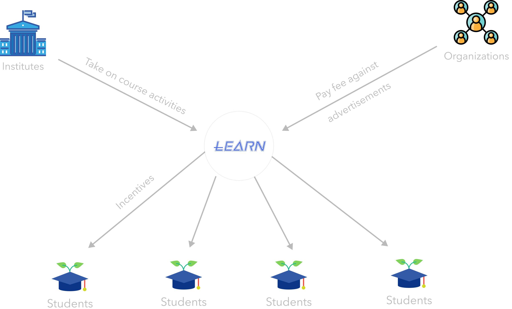
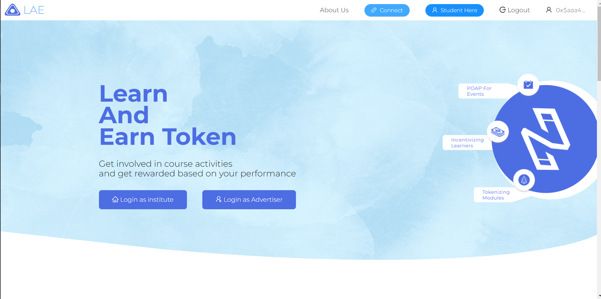
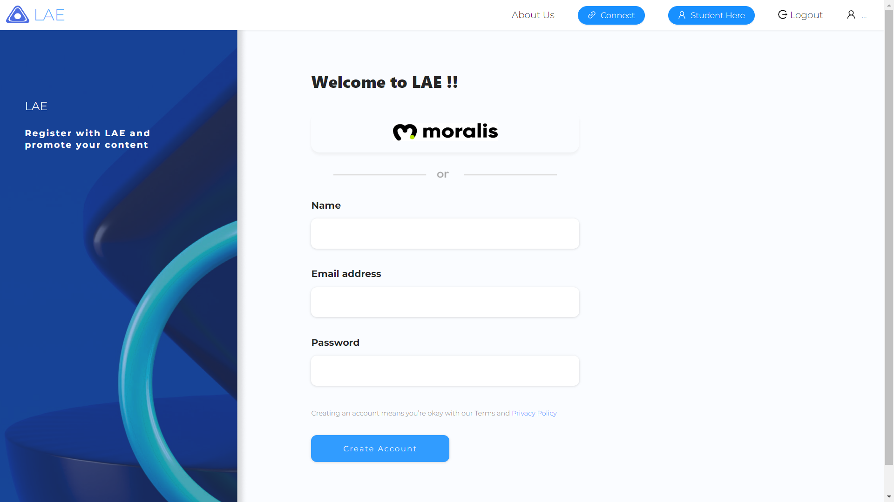
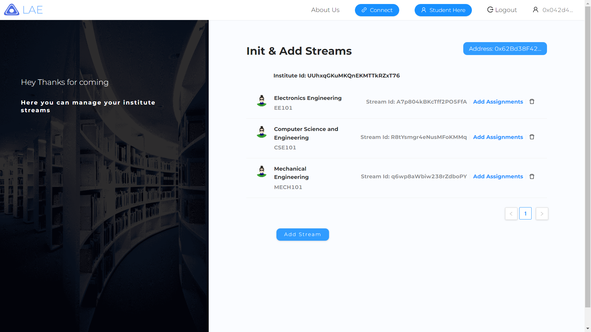
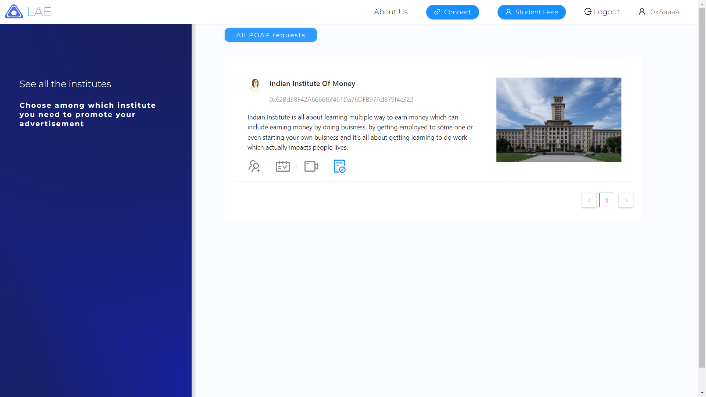
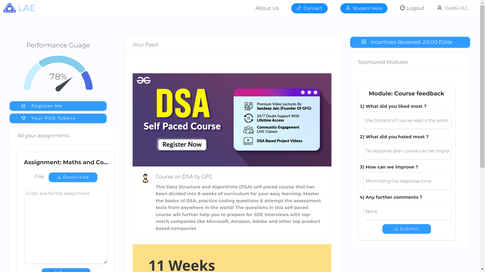
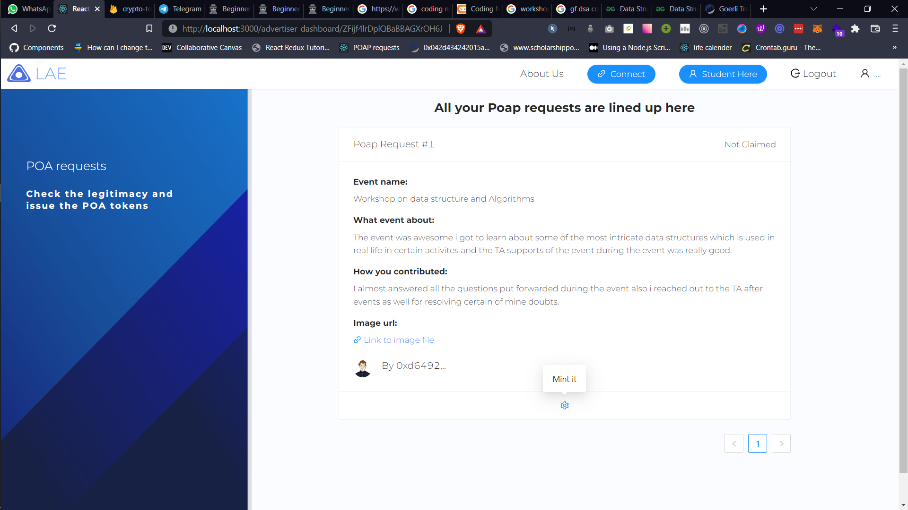

## Project: College $Buddy
## Problem

- To Make people work effectively there should be some kind of incentive attached to the work they are doing.
- No direct connections between third party ed tech org and student communities they need to rely on general platforms, campus ambassador programs, referral programs etc for their promotion.
- Student these days consider their course work as burden on them and unwillingly get involved in them and with the onset of remote era the engagement has been drastically reduced towards their course activities.
- There is a need of a proof of work mechanism for students to get validated on their engagement in some activities(attending workshops, session, course completion etc).

## Solution: College Buddy (LearnAndEarn) 

- It is a self sustainable tokenized learning platform which will incentivize students at the end of each month with some tokens based on their performance score into the platform.
- Institutes will be required to do one time setup and they can start using this platform as a normal LMS platform.
- The performance score will be calculated based on the engagement of student in course related activities which involves (timely completion of assignments, good grades in quizzes etc) and at the end of each month a comparative score will be calculated and based on it tokens will be rewarded.

### Who will sponsor incentives to students ?

- This platform will have a separate feed which the third party ed tech organizations can leverage for promoting their course/content/events and in order to use this they will be require to pay some fees to the platform which can further be utilize to incentivize students.
- Advertisers could leverage this platform in three ways:
    - Normal advertisements (poster, information etc).
    - Tokenized modules (for survey, feedback etc) which will instantly reward the respondent.
    - POAP based events advertisers can launch events for students and on successful attendance students can claim the POAP for the event.

## Tech Stack behind the solutions:

 <b> Smart Contracts: </b> When ever a new institute is registered a funds manager smart contract is deployed which will manage all funds coming from advertiser to institute. 

 <b> SuperFluid IDA: </b> Leveraged the Superfluid instant distribution agreement for distributing super tokens to the students based upon their score. 

  <b> Gelato: </b> For setting up task for distributing tokens on a monthly basis. 

 <b> Pinata: </b> For saving Proof Of Attendence (POA) token metadata to IPFS. 
   
  
 #### Token used: fDAIx
 #### Token address on mumbai testnet: 0x5D8B4C2554aeB7e86F387B4d6c00Ac33499Ed01f
 #### Institute Funds Manager Contract: 0x5a846208b94F874325aB8B91C226C477aC72C1be
 #### Proof of Attendence Token Contract: 0x4c2BA21D58324F94FD1A924B9C09dA7B9e920F21
 
 ## Architecture at a glimpse:
  
 
 ## Snaps:
  
  
    
    
    
    
    
  
 ### WAGMI
